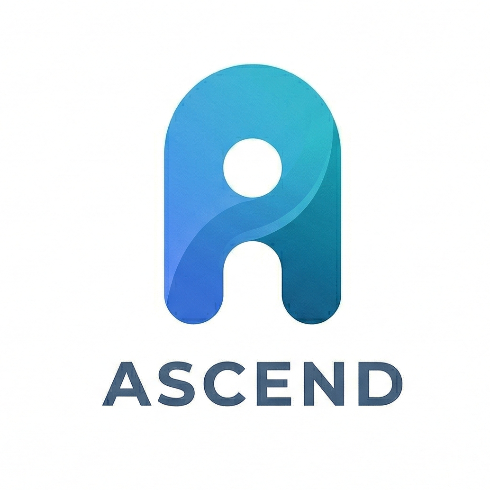

<div align="center">
  
</div>

# Ascend

[](https://flutter.dev)
[](https://dart.dev)
[](LICENSE)

**Ascend** is a premium, all-in-one productivity suite designed to help you organize your life, track your habits, and focus on what matters most. Built with Flutter and powered by Riverpod and Drift, it provides a seamless, high-performance experience across all platforms.

---

## Features

### Smart Timeline
Experience a beautiful, organized view of your day. Manage tasks with ease, set priorities, and never miss a deadline.

### Daily Journal
Reflect on your journey. A dedicated space for thoughts, memories, and daily gratitude. Connect with your inner self.

### Habit Tracker
Build lasting routines. Track streaks, visualize progress with interactive charts, and gamify your productivity.

### Focus Mode
Deep work made simple. A minimalist Pomodoro-style timer designed to keep you in the zone and minimize distractions.

---

## Preview & Showcase

<div align="center">
  
  
  
  
  <br/>
  
  
  
  
</div>

*Visual showcase of the Ascend Productivity Suite.*

---

## Project Structure

The project follows a feature-first clean architecture pattern for maximum scalability and maintainability.

```text
lib/
├── core/               # App-wide themes, constants, and utilities
├── data/               # Persistent storage and database (Drift)
├── domain/             # Business logic and data models
├── feature/            # Feature-based modular structure
│   ├── auth/           # Authentication flow
│   ├── calender/       # Timeline & Calendar view
│   ├── focus_mode/     # NEW: Pomodoro & Focus Timer
│   ├── habit_tracker/  # NEW: Productivity streaks & tracking
│   ├── journal/        # NEW: Daily reflection & notes
│   ├── profile/        # User stats and analytics
│   └── settings/       # App configuration
├── view_model/         # Global state management (Riverpod)
└── main.dart           # Entry point
```

---

## Getting Started

### Prerequisites

- Flutter SDK (>= 3.10.7)
- Dart SDK
- Android Studio / VS Code with Flutter extension

### Installation

1. **Clone the repository**
   ```bash
   git clone https://github.com/onimusha-dev/ascend-mobile.git
   cd ascend-mobile
   ```

2. **Install dependencies**
   ```bash
   flutter pub get
   ```

3. **Generate local database and models**
   ```bash
   flutter pub run build_runner build --delete-conflicting-outputs
   ```

4. **Run the app**
   ```bash
   flutter run
   ```

---

## Commands Reference

| Command | Description |
|---------|-------------|
| `flutter pub get` | Install dependencies |
| `flutter pub run build_runner build` | Run one-time code generation |
| `flutter pub run build_runner watch` | Run continuous code generation |
| `flutter analyze` | Run static analysis |
| `flutter test` | Run unit and widget tests |

---

## Hire Me!

I am a passionate Flutter Developer dedicated to building high-quality, performant, and beautiful applications.

- **Email**: [your.email@example.com]
- **LinkedIn**: [linkedin.com/in/yourprofile]
- **Portfolio**: [yourportfolio.com]

---

<div align="center">
  MADE BY ONIMUSHA
</div>
